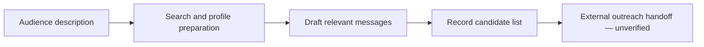

# High-level architecture

```mermaid
flowchart LR
  S0["Audience description"]
  S1["Search and profile preparation"]
  S2["Draft relevant messages"]
  S3["Record candidate list"]
  S4["External outreach handoff — unverified"]
  S0 --> S1
  S1 --> S2
  S2 --> S3
  S3 --> S4
```

This is a conceptual view. It omits node configuration, API endpoints, prompts and implementation rules. Every stage in this reference remains execution-unverified.
